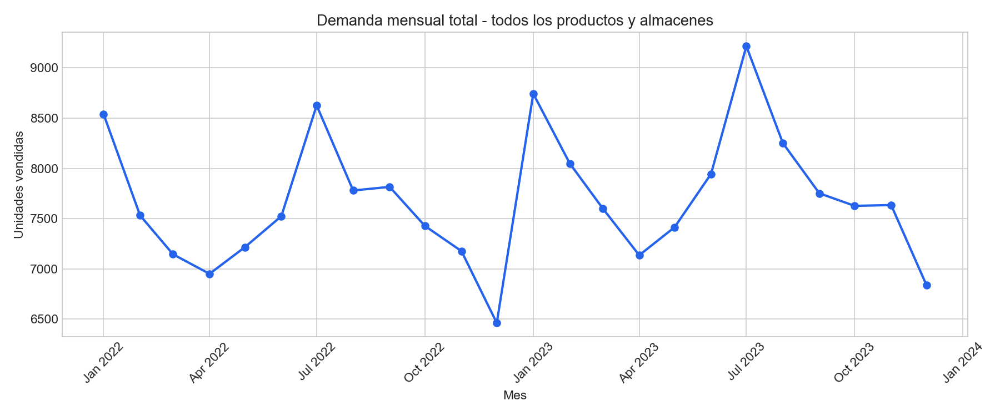
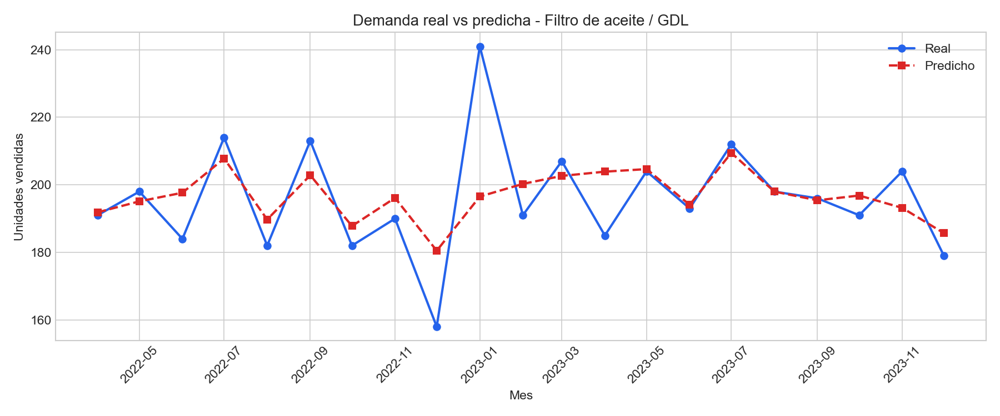
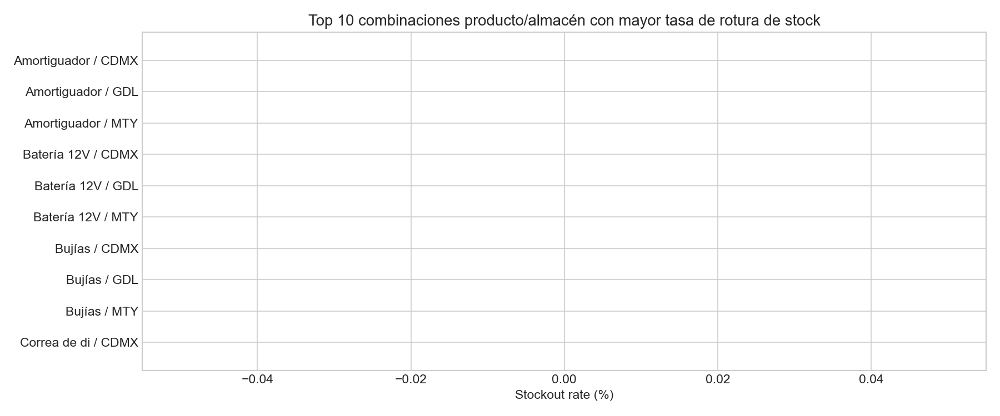
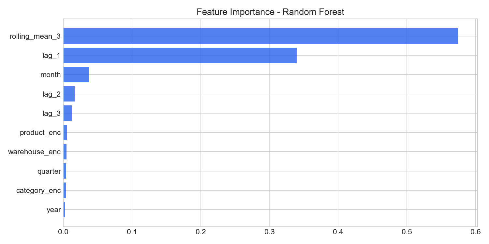

# Demand & Inventory Forecasting

ML pipeline for monthly demand forecasting and inventory replenishment using Random Forest, time-series cross-validation, and a SQL extraction layer simulating ERP/WMS integration.

---

## Business Context

In distribution and retail operations, stockouts and overstock are directly tied to forecast accuracy. This project simulates a real-world scenario in the automotive parts industry, where demand varies by product, warehouse, and seasonality.

The pipeline covers the full cycle: data extraction from a relational source (ERP/WMS), exploratory analysis, model training, evaluation, and generation of a replenishment suggestion table ready for operational use.

---

## Project Structure

```
demand-inventory-forecasting/
├── data/
│   ├── sales_raw.csv              # Historical monthly sales by product and warehouse
│   ├── inventory_raw.csv          # Stock levels, reorder points and lead times
│   └── reorder_suggestions.csv    # Model output: replenishment table
├── notebooks/
│   └── 01_demand_forecasting.ipynb
├── sql/
│   └── create_tables_and_queries.sql
├── img/
│   ├── 01_demanda_mensual_total.png
│   ├── 02_demanda_por_producto.png
│   ├── 03_revenue_por_almacen.png
│   ├── 04_stockout_rate.png
│   ├── 05_feature_importance.png
│   └── 06_real_vs_predicho.png
└── generate_data.py
```

---

## Pipeline Overview

**1. Data Generation**
Simulated dataset of 8 products across 3 warehouses (CDMX, GDL, MTY) over 24 months. Includes trend, seasonality, warehouse-level variation, and random noise.

**2. SQL Layer**
Table definitions and extraction queries that replicate how data would be pulled from an ERP/WMS system. Includes stockout analysis and replenishment alert queries.

**3. Exploratory Analysis**
- Monthly demand trends
- Per-product demand patterns
- Revenue breakdown by warehouse
- Stockout rate by product/warehouse combination

**4. Feature Engineering**
- Lag features: units sold at t-1, t-2, t-3
- Rolling mean (3-month window)
- Temporal features: year, month, quarter
- Label-encoded categorical variables

**5. Modeling**
- Algorithm: `RandomForestRegressor`
- Validation: `TimeSeriesSplit` (3 folds) to respect temporal order
- Metrics: MAE and MAPE per fold

**6. Business Output**
Replenishment suggestion table with forecasted demand, current stock, and units to order per product/warehouse. Exported as `reorder_suggestions.csv`.

---

## Results

| Metric | Value |
|---|---|
| Model | Random Forest Regressor |
| Granularity | Product × Warehouse × Month |
| Validation strategy | TimeSeriesSplit (3 folds) |
| Key features | lag_1, rolling_mean_3, month |
| Output | Replenishment table per product/warehouse |

---

## Visualizations

### Monthly Demand


### Real vs Predicted — Filtro de aceite / GDL


### Stockout Rate by Product/Warehouse


### Feature Importance


---

## Stack

- Python 3.10+
- pandas, numpy
- scikit-learn
- matplotlib
- PostgreSQL (SQL layer)

---

## How to Run

```bash
# 1. Generate datasets
python generate_data.py

# 2. Convert script to notebook
pip install jupytext
jupytext --to notebook notebooks/01_demand_forecasting.py

# 3. Open and run
jupyter notebook notebooks/01_demand_forecasting.ipynb
```

---

## Author

Alan Ramsés Pérez Pelayo  
Data Analyst → Data Scientist  
[LinkedIn](https://linkedin.com/in/alan-pelayo) · [GitHub](https://github.com/sizsmar)
